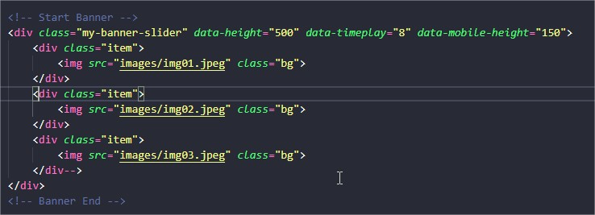

# Banner rotativo

<a href="https://jsfiddle.net/phscezario/jam9xL50/15/" target="new">Veja aqui</a>
Talvez não apresente a ultima versão postada!

## Como usar:

### Na DIV pai

Colocar a classe: "my-banner-slide" é obrigatório.

O atributo "data-height"(altura) tem como padrão 250px, adicione o atributo com valor desejado.

Os atributos "data-playtime" "data-mobile-height", são opcionais e controlam o tempo para o slider mudar e a altura em dispositivos móveis respectivamente.

### Nas DIVs filhos

Cada filho é definido por uma DIV com a classe "item": "div class="item"

Uma imagem com o atributo class="bg", define que a mesma irá se tornar o background do mesmo slide.

Você pode colocar qualquer conteúdo dentro do slide, eles ficam a critério do utilizador.

